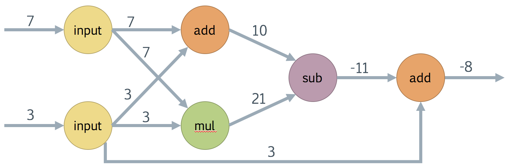
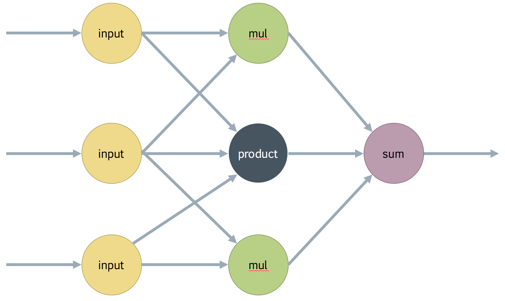
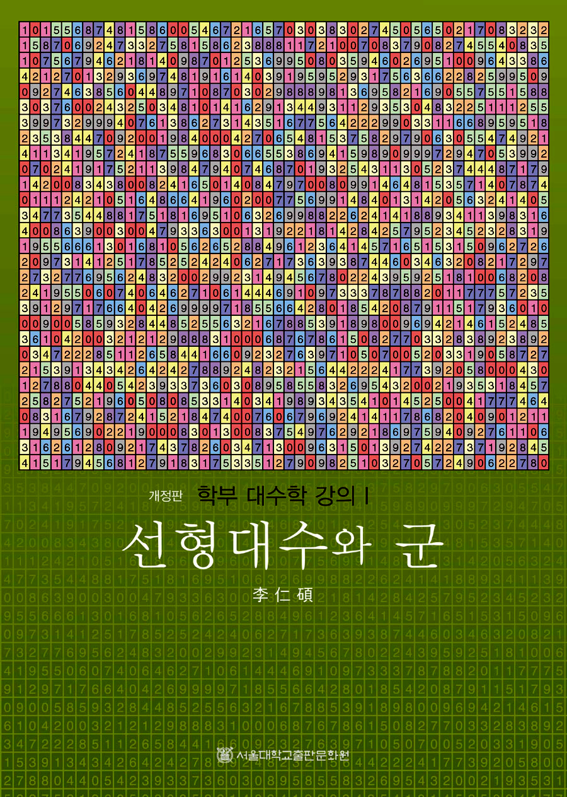

# Posco & Postech - AI Big Data Study

### Every Monday at 7 o'clock

## DL Study Lec1 - 모두를 위한 딥러닝 강좌 시즌 1 (Sung Kim)
https://www.youtube.com/playlist?list=PLlMkM4tgfjnLSOjrEJN31gZATbcj_MpUm

## DL Study Lec2 - Stanford University CS231n, Spring 2017
https://www.youtube.com/watch?v=vT1JzLTH4G4&list=PLC1qU-LWwrF64f4QKQT-Vg5Wr4qEE1Zxk

## Platform - Tensorflow
- What is Tensorflow? 
	- Framework for math using computation graphs 
	- Has Features specifically for machine learning 
	- Primary interface is Python, integrates with NumPy 
		- Implemented in C++ & CUDA 
	- Designed to be flexible, scalable, and deplyable

### HW1 - OR,AND,NAND,XOR
- Computation Graph for OR, AND, NAND, XOR

### HW2 - Mnist for Boj 15636
- Create a Mnist model that categorizes the numbers shown in the figure.

### HW3 - Backpropagation